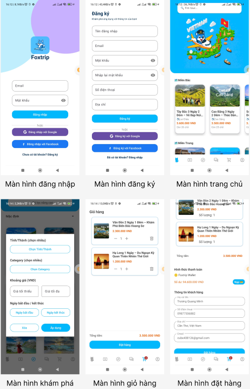
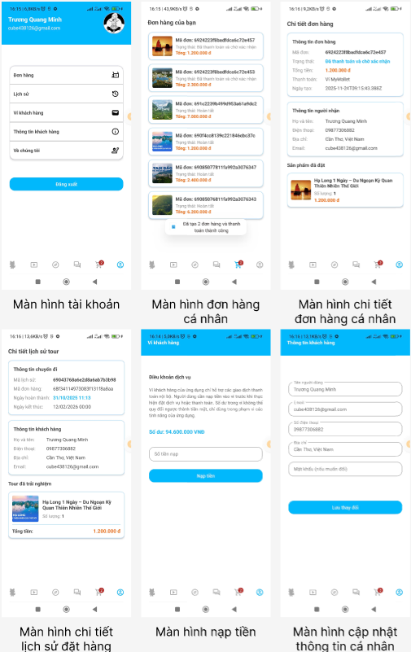
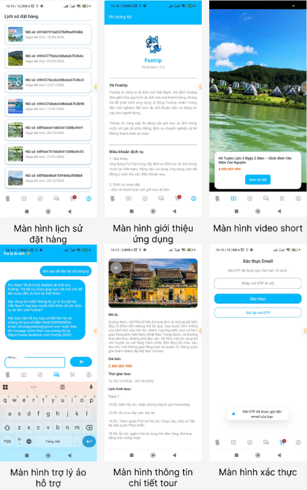
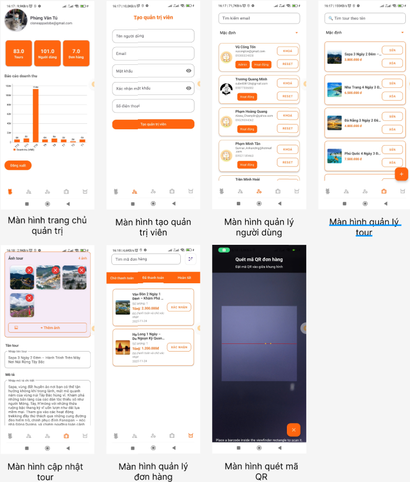

# 🦊 FoxTrip - Ứng dụng Du lịch Di động

Ứng dụng di động cung cấp và quản lý các dịch vụ du lịch, cho phép người dùng tìm kiếm, đặt tour và quản lý chuyến đi một cách tiện lợi.

## 📋 Giới thiệu

FoxTrip là ứng dụng du lịch di động được phát triển bằng Java trên nền tảng Android, tích hợp hệ thống RESTful API xây dựng bằng Node.js và Express.js.

## 🛠️ Công nghệ sử dụng

### Android (Client)
- **Ngôn ngữ:** Java
- **IDE:** Android Studio
- **Min SDK:** 24 (Android 7.0)
- **Target SDK:** 36
- **Kiến trúc:** MVVM (Model-View-ViewModel)
- **Thư viện chính:**
  - Retrofit - Gọi RESTful API
  - Glide - Tải và cache hình ảnh
  - ViewBinding & DataBinding
  - Google Sign-In & Facebook Login
  - MPAndroidChart - Biểu đồ thống kê
  - ZXing - Quét mã QR
  - ExoPlayer - Phát video

### Backend (Server)
- **Runtime:** Node.js
- **Framework:** Express.js
- **Database:** MongoDB Atlas
- **Thư viện chính:**
  - Mongoose - ODM cho MongoDB
  - JWT (jsonwebtoken) - Xác thực
  - Bcrypt - Mã hóa mật khẩu
  - Cloudinary - Lưu trữ hình ảnh
  - Nodemailer - Gửi email
  - Google Generative AI - Chatbot AI

## ✨ Tính năng

### Dành cho Khách hàng
- 🔐 Đăng ký/Đăng nhập (Email, Google, Facebook)
- 🔍 Tìm kiếm tour theo tên
- 🎯 Lọc tour nâng cao (tỉnh thành, giá, thời gian)
- 📹 Xem video short giới thiệu tour
- 📖 Xem chi tiết tour (mô tả, lịch trình, hình ảnh)
- 🛒 Quản lý giỏ hàng
- 💳 Đặt tour và thanh toán
- 📋 Quản lý đơn hàng cá nhân
- 📜 Xem lịch sử đặt tour
- 💰 Nạp tiền vào ví
- 🤖 Trợ lý ảo AI hỗ trợ
- 👤 Quản lý thông tin cá nhân

### Dành cho Quản trị viên (Admin)
- 👥 Quản lý người dùng (khóa/mở tài khoản)
- 🏝️ Quản lý tour (CRUD)
- 📦 Quản lý đơn hàng (xác nhận, hủy, quét QR)
- 📊 Báo cáo doanh thu với biểu đồ thống kê
- 👨‍💼 Tạo tài khoản admin (Super Admin)

## 📁 Cấu trúc dự án

```
FoxTrip/
├── Android/                    # Ứng dụng Android
│   ├── app/
│   │   ├── src/main/
│   │   │   ├── java/vn/androidhaui/foxtrip/
│   │   │   └── res/
│   │   └── build.gradle.kts
│   └── gradle/
│
├── Backend/                    # Server Node.js
│   ├── app/
│   │   ├── controllers/        # Xử lý logic
│   │   ├── models/             # Schema MongoDB
│   │   ├── middlewares/        # Middleware xác thực
│   │   ├── jobs/               # Cron jobs
│   │   └── utils/              # Tiện ích
│   ├── config/                 # Cấu hình DB, Cloudinary
│   ├── routes/                 # Định tuyến API
│   ├── services/               # Business logic
│   └── server.js               # Entry point
│
└── README.md
```

## 🚀 Cài đặt và Chạy

### Yêu cầu
- Node.js >= 18.x
- Android Studio (Hedgehog trở lên)
- MongoDB Atlas account
- Cloudinary account

### Backend

1. Di chuyển vào thư mục Backend:
```bash
cd Backend
```

2. Cài đặt dependencies:
```bash
npm install
```

3. Tạo file `.env` với các biến môi trường:
```env
PORT=3000
MONGODB_URI=your_mongodb_connection_string
JWT_SECRET=your_jwt_secret
CLOUDINARY_CLOUD_NAME=your_cloud_name
CLOUDINARY_API_KEY=your_api_key
CLOUDINARY_API_SECRET=your_api_secret
```

4. Chạy server:
```bash
npm start
```

### Android

1. Mở thư mục `Android` bằng Android Studio
2. Sync Gradle
3. Cấu hình `google-services.json` cho Firebase/Google Sign-In
4. Cập nhật BASE_URL trong code để trỏ đến Backend server
5. Build và chạy trên thiết bị/emulator

## 📱 Screenshots






## 📊 Database Schema

Hệ thống sử dụng MongoDB với các collection chính:
- **User** - Thông tin người dùng
- **Tour** - Thông tin tour du lịch
- **Cart** - Giỏ hàng
- **Order** - Đơn hàng
- **History** - Lịch sử đặt tour
- **Wallet** - Ví điện tử
- **RevenueReport** - Báo cáo doanh thu

## 🔒 Bảo mật

- Mật khẩu được mã hóa bằng Bcrypt
- Xác thực bằng JWT Token
- Xác thực OTP qua email khi đặt hàng
- Phân quyền User/Admin/Super Admin
